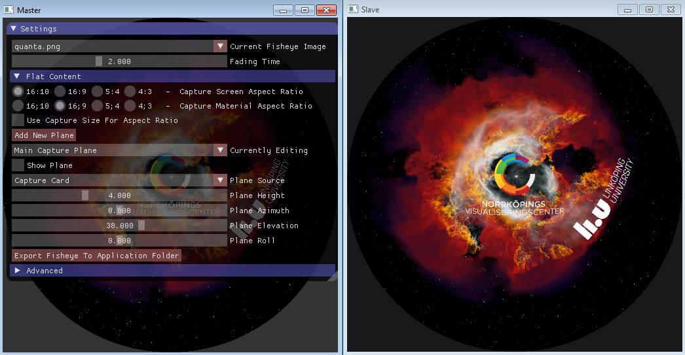
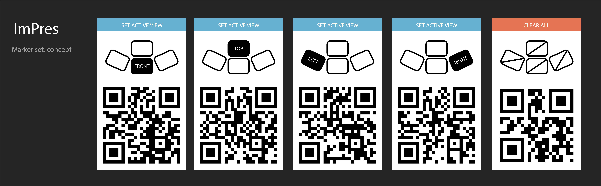

DomePres/ImPres - Presentation tool for domes or other immersive environments
===========

Minimal effort/time solution for customizable immersive presentation.
Goal is to create an inituative way of utilizing an immersive environment as presentation display in a much better way than having a flat image at one single location during the whole presentation, but still driving the content from the presenters own presentation tool of choice.

Current version (below) utilizes a capturing of a DirectShow source (framegrabber), for instance a laptop running a Powerpoint or Keynote, with the possibility of interactivly placing various images (immersive and flat) around the capture display areas. Focus is on fast setup without a substantial learning curve. 

Use markers inside your presentation to control the image planes.

